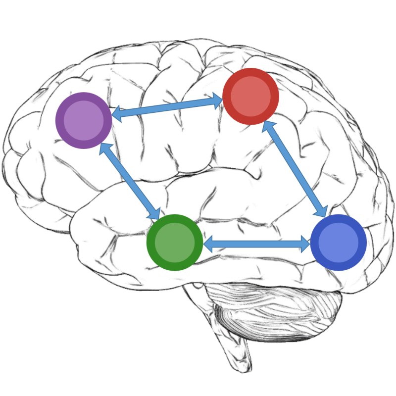

# SPM.jl

```@raw html
 
```


## Introduction

`SPM.jl` is a [Julia](https://julialang.org/) package alongside
the [SPM software](https://www.fil.ion.ucl.ac.uk/spm/), designed
for the analysis of brain imaging data sequences.

!!! warning
    SPM.jl is work in progress [see issue #2](https://github.com/spm/SPM.jl/issues/2#issuecomment-1700902258)
    > @JohnAshburner 
    > There is not yet much translation of SPM work into Julia. What has been done so far was just to explore Julia's potential. How much will be done in future will depend on the resources available to the SPM developer team.
    
    


